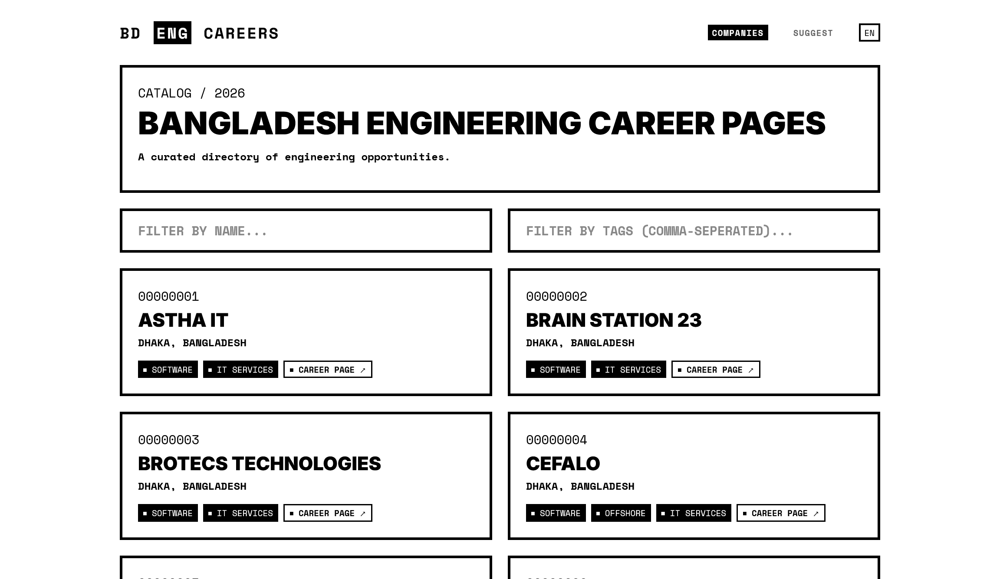

# BD Engineering Career Pages

[**Live Site**](https://career-pages-bd.vercel.app/)

A curated directory of engineering career pages for companies in Bangladesh. This site aims to help software engineers and tech professionals find job opportunities by providing a centralized list of career portals.



## 🚀 Features

- **Curated Directory**: A list of tech companies operating in Bangladesh with direct links to their official career pages.
- **Search & Filter**: Search by company name or filter by tags (e.g., Technology, Industry, Job Type).
- **Contribution-First**: Users can suggest new companies or updates via the "Suggest" page.
- **Serverless Backend**: Uses Vercel Functions to securely proxy data from Cloud Firestore.
- **Dynamic Data**: Powered by Google Cloud Firestore, ensuring the catalog stays up-to-date in real-time.

## 🛠️ Tech Stack

- **Frontend**: React 19 (Vite)
- **Backend**: Vercel Functions (Node.js)
- **Database**: Cloud Firestore
- **Language**: TypeScript
- **Styling**: Vanilla CSS (Modern Brutalist aesthetic)

## 📦 Getting Started

### Prerequisites

- Node.js (v22 or higher)
- npm or yarn
- [Firebase CLI](https://firebase.google.com/docs/cli) (optional, for DB management)
- [Vercel CLI](https://vercel.com/docs/cli) (optional, for local serverless development)

### Installation

1. Clone the repository:
   ```bash
   git clone https://github.com/ryanhossain9797/career_pages.git
   ```

2. Install dependencies:
   ```bash
   npm install
   ```

3. Configure Environment Variables:
   Create a `.env` file based on `.env.example` (if present) or set up your Firebase Service Account keys in the Vercel dashboard.

4. Start the development server:
   ```bash
   npm run dev
   ```

5. Build for production:
   ```bash
   npm run build
   ```

## 🤝 Contributing

Contributions are welcome! If you know of a company that is missing or find incorrect information:

1. Visit the **Suggest** page on the website.
2. Follow the instructions to suggest changes.

Alternatively, you can open an issue or submit a pull request if you want to contribute to the codebase itself.

## 📄 License

This project is licensed under the MIT License - see the LICENSE file for details.
