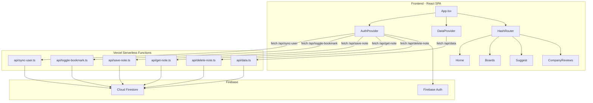
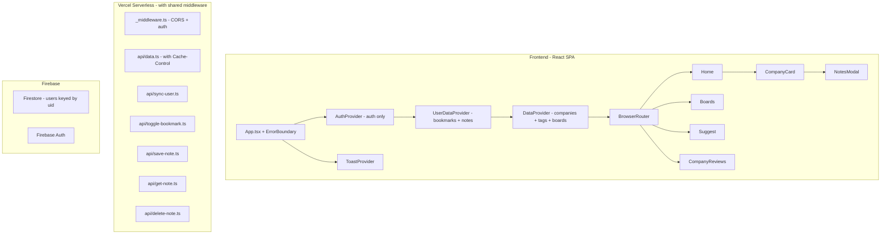

# Architecture Review — BD Eng Careers

## Executive Summary

This is a React 19 + Vite application with Vercel serverless functions, Firebase Auth, and Cloud Firestore. The codebase is small (~30 files), well-organized, and functional. The review identifies **7 high-priority** and **8 medium-priority** optimization opportunities across API design, state management, security, performance, and code quality.

---

## Current Architecture



---

## Findings & Recommendations

### 🔴 HIGH PRIORITY

#### 1. ~~Bloated AuthContext — Violates Single Responsibility Principle~~ DONE

**File:** [`AuthContext.tsx`](src/context/AuthContext.tsx:1)

**Problem:** The [`AuthProvider`](src/context/AuthContext.tsx:25) manages authentication state AND all user-data operations (bookmarks, notes CRUD). This creates several issues:
- Any bookmark/note change triggers re-renders of every component consuming `useAuth()` because `profile` is in the same context
- The context is ~250 lines and growing — every new user feature will bloat it further
- Business logic (API calls, optimistic updates) is mixed with auth state management

**Recommendation:** Extract user data operations into a separate `UserDataContext` or custom hooks:

```
src/context/AuthContext.tsx    → Auth only: user, loading, signIn, signOut
src/hooks/useBookmarks.ts     → toggleBookmark, isBookmarked
src/hooks/useNotes.ts         → getNote, saveNote, deleteNote
```

Alternatively, a single `UserDataContext` that depends on `AuthContext` for the user/token.

---

#### 2. Massive API Boilerplate — No Shared Middleware

**Files:** All files in [`api/`](api/)

**Problem:** Every API handler repeats the exact same ~20 lines of:
- CORS headers (identical across all 6 files)
- OPTIONS preflight handling
- Authorization header extraction
- Token verification via `auth.verifyIdToken()`
- User document lookup via `usersRef.where('authUid', '==', uid).limit(1).get()`

This is ~100+ lines of duplicated code across the API layer.

**Recommendation:** Create shared middleware utilities:

```
api/_middleware.ts  → setCorsHeaders(), handlePreflight()
api/_auth.ts       → verifyAndGetUser(req) → returns { uid, userDoc, userId }
```

Each handler would then be reduced to just its core business logic.

---

#### 3. HashRouter Instead of BrowserRouter

**File:** [`App.tsx`](src/App.tsx:2)

**Problem:** The app uses `HashRouter` (line 2: `import { HashRouter as Router }`), but the [`CONTEXT_FOR_ROBOTS.md`](CONTEXT_FOR_ROBOTS.md:11) states it should use "standard browser routing on Vercel." HashRouter produces URLs like `/#/boards` instead of `/boards`, which:
- Hurts SEO (hash fragments are not indexed)
- Looks unprofessional
- Is unnecessary on Vercel which supports SPA fallback routing natively

**Recommendation:** Switch to `BrowserRouter`. Add a `vercel.json` rewrite rule if not already present:
```json
{ "rewrites": [{ "source": "/(.*)", "destination": "/index.html" }] }
```

---

#### 4. XSS Vulnerability in CompanyReviews

**File:** [`CompanyReviews.tsx`](src/pages/CompanyReviews.tsx:124)

**Problem:** Line 124 uses `dangerouslySetInnerHTML={{ __html: review.body }}` with HTML scraped from an external site (`deshimula.com`) via a CORS proxy. This is a textbook XSS vector — if the scraped HTML contains `<script>` tags or event handlers, they will execute in the user's browser.

**Recommendation:** Sanitize the HTML before rendering. Use a library like `DOMPurify`:
```tsx
import DOMPurify from 'dompurify';
// ...
<div dangerouslySetInnerHTML={{ __html: DOMPurify.sanitize(review.body) }} />
```

---

#### 5. No API Caching or Rate Limiting

**Files:** [`DataContext.tsx`](src/context/DataContext.tsx:17), all [`api/`](api/) handlers

**Problem:**
- The `/api/data` endpoint fetches ALL companies, tags, and boards from Firestore on every page load with no caching. This means every visitor triggers 3 Firestore reads.
- No `Cache-Control` headers are set on any API response
- No rate limiting on authenticated endpoints — a malicious user could spam bookmark/note operations

**Recommendation:**
- Add `Cache-Control` headers to `/api/data` (e.g., `s-maxage=300, stale-while-revalidate=600`) since company data changes infrequently
- Consider Vercel Edge Config or ISR for the data endpoint
- Add basic rate limiting via Vercel's built-in features or a simple in-memory counter per user

---

#### 6. User Lookup by Query Instead of Document ID

**Files:** [`sync-user.ts`](api/sync-user.ts:36), [`toggle-bookmark.ts`](api/toggle-bookmark.ts:46), [`save-note.ts`](api/save-note.ts:46), [`get-note.ts`](api/get-note.ts:42), [`delete-note.ts`](api/delete-note.ts:43)

**Problem:** Every authenticated API call performs a Firestore **query** to find the user document:
```ts
usersRef.where('authUid', '==', uid).limit(1).get()
```
This is an indexed query that costs a read operation each time. Since the `authUid` is unique and known at creation time, the document ID should **be** the `authUid`.

**Recommendation:** Use `uid` as the Firestore document ID for users:
```ts
const userDocRef = db.collection('users').doc(uid);
const userDoc = await userDocRef.get();
```
This is a direct document lookup — faster, cheaper, and simpler. This is a data migration but would eliminate a query from every single authenticated request.

---

#### 7. `alert()` for Error Handling

**Files:** [`AuthContext.tsx`](src/context/AuthContext.tsx:74) (lines 74, 109, 139, 176, 210), [`CompanyCard.tsx`](src/components/CompanyCard.tsx:43)

**Problem:** The app uses `alert()` and `confirm()` for user-facing error messages and confirmations. This:
- Blocks the main thread
- Cannot be styled to match the app's design system
- Provides a jarring UX inconsistent with the polished "Industrial Rally" aesthetic

**Recommendation:** Implement a toast/notification system. A simple approach:
- Create a `ToastContext` with `showToast(message, type)` 
- Render toasts as styled overlay components matching the design system
- Replace all `alert()` calls with `showToast()`

---

### 🟡 MEDIUM PRIORITY

#### 8. Tag Lookup is O(n) Per Company Per Tag

**File:** [`Home.tsx`](src/pages/Home.tsx:31), [`CompanyCard.tsx`](src/components/CompanyCard.tsx:124)

**Problem:** Tags are looked up via `tags.find(t => t.id === tagId)` inside nested loops — once during filtering (Home.tsx:31) and again during rendering (CompanyCard.tsx:124). With N companies and M tags, this is O(N×M) per render.

**Recommendation:** Create a `Map<string, Tag>` lookup once in `DataContext` or `Home`:
```ts
const tagMap = useMemo(() => new Map(tags.map(t => [t.id, t])), [tags]);
```
Pass `tagMap` instead of `tags[]` to components.

---

#### 9. Inline Callbacks Recreated Every Render

**File:** [`Home.tsx`](src/pages/Home.tsx:81)

**Problem:** The `onToggleBookmark` callback is created inline inside `.map()` (line 81-90), creating a new function reference for every company on every render. This defeats `React.memo` if it were ever applied to `CompanyCard`.

**Recommendation:** Use `useCallback` with the company ID, or restructure so `CompanyCard` receives the company ID and calls a stable context function directly.

---

#### 10. Dead Data Source Reference

**File:** [`companies.ts`](src/data/companies.ts:4)

**Problem:** `DATA_URL` points to a GitHub Gist but is never imported or used anywhere in the codebase. The app actually fetches from `/api/data` (Firestore). This is dead code that could confuse future developers.

**Recommendation:** Remove `DATA_URL` from [`companies.ts`](src/data/companies.ts:4) or add a comment explaining it's the legacy/fallback source. The [`Suggest`](src/pages/Suggest.tsx:27) page still links to this Gist for user contributions, so the URL could move to [`constants/app.ts`](src/constants/app.ts:1) if needed.

---

#### 11. No Loading/Error Boundaries

**Problem:** There are no React Error Boundaries in the component tree. If any component throws during render (e.g., malformed data from the API), the entire app crashes with a white screen.

**Recommendation:** Add an `ErrorBoundary` component wrapping `<Routes>` that catches render errors and shows a styled fallback UI. React 19's improved error handling makes this straightforward.

---

#### 12. `useMemo` Dependency Array Missing Functions

**File:** [`AuthContext.tsx`](src/context/AuthContext.tsx:224)

**Problem:** The `useMemo` on line 224 lists `[user, profile, loading]` as dependencies, but the value object includes functions like `signInWithGoogle`, `signOut`, `toggleBookmark`, etc. These functions close over `user` and `profile` state, so they're recreated on every render anyway. The `useMemo` gives a false sense of optimization — the object reference changes whenever `user`, `profile`, or `loading` changes, which is correct, but the functions themselves are not memoized.

**Recommendation:** Wrap each function in `useCallback` with appropriate dependencies. Then the `useMemo` will actually prevent unnecessary re-renders of consumers.

---

#### 13. Inconsistent Error Response Shapes

**Files:** All [`api/`](api/) handlers

**Problem:** Error responses use inconsistent shapes:
- `{ error: 'Unauthorized', message: '...' }` (sync-user, toggle-bookmark)
- `{ error: 'Internal Server Error', message: '...' }` (data.ts includes `error.message`)
- `{ error: 'Bad Request', message: '...' }` (toggle-bookmark, save-note)

Success responses also vary: some return `{ success: true, message: '...' }`, others return data directly.

**Recommendation:** Standardize API response shapes:
```ts
// Success
{ success: true, data: T }
// Error  
{ success: false, error: { code: string, message: string } }
```

---

#### 14. No TypeScript Types for API Responses

**Problem:** API handlers use `any` types for error catches and request bodies. The frontend also uses `any` in catch blocks throughout [`AuthContext.tsx`](src/context/AuthContext.tsx:72). There are no shared types between the API layer and the frontend.

**Recommendation:** Create shared API response types in a `types/api.ts` file. Use discriminated unions for success/error responses. Replace `catch (error: any)` with proper error narrowing.

---

#### 15. CompanyCard is Too Complex

**File:** [`CompanyCard.tsx`](src/components/CompanyCard.tsx:1)

**Problem:** `CompanyCard` is 188 lines and handles:
- Card rendering with variant styling
- Broken data state
- Bookmark toggling with loading state
- Notes modal with full CRUD (open, save, delete, cancel)
- Portal rendering

This violates single responsibility and makes the component hard to test or modify.

**Recommendation:** Extract the notes modal into a separate `NotesModal` component:
```
src/components/CompanyCard.tsx   → Card rendering + bookmark button
src/components/NotesModal.tsx    → Modal with note CRUD logic
```

---

## Proposed Architecture



---

## Implementation Priority

| # | Item | Priority | Impact | Scope |
|---|------|----------|--------|-------|
| 1 | Extract API middleware to reduce boilerplate | 🔴 High | DX, Maintainability | API layer |
| 2 | Split AuthContext into Auth + UserData | 🔴 High | Performance, Maintainability | Frontend |
| 3 | Switch HashRouter → BrowserRouter | 🔴 High | SEO, UX | Frontend |
| 4 | Sanitize scraped HTML with DOMPurify | 🔴 High | Security | Frontend |
| 5 | Add Cache-Control to /api/data | 🔴 High | Performance, Cost | API layer |
| 6 | Use uid as Firestore document ID | 🔴 High | Performance, Cost | API + DB migration |
| 7 | Replace alert/confirm with toast system | 🔴 High | UX | Frontend |
| 8 | Create tag lookup Map | 🟡 Medium | Performance | Frontend |
| 9 | Stabilize callbacks with useCallback | 🟡 Medium | Performance | Frontend |
| 10 | Remove dead DATA_URL | 🟡 Medium | Code hygiene | Frontend |
| 11 | Add ErrorBoundary | 🟡 Medium | Reliability | Frontend |
| 12 | Fix useMemo + useCallback in AuthContext | 🟡 Medium | Performance | Frontend |
| 13 | Standardize API response shapes | 🟡 Medium | DX, Consistency | API layer |
| 14 | Add shared API types | 🟡 Medium | Type safety | Shared |
| 15 | Extract NotesModal from CompanyCard | 🟡 Medium | Maintainability | Frontend |

---

## Out of Scope (But Worth Noting)

- **Testing:** No tests exist. Adding at least API handler tests and key component tests would be valuable.
- **Accessibility:** No ARIA labels on interactive elements beyond the user menu button. The search inputs lack `<label>` elements.
- **Bundle size:** `firebase` (client SDK) is a large dependency. Consider using modular imports if not already tree-shaken by Vite.
- **Environment validation:** No runtime validation of `VITE_` env vars beyond the console.error in [`firebase.ts`](src/lib/firebase.ts:14). The app will crash silently if misconfigured.
