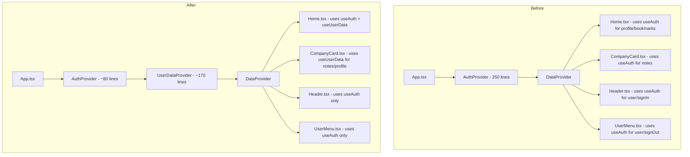

# AuthContext Refactor Plan

## Goal

Split the monolithic [`AuthContext.tsx`](src/context/AuthContext.tsx:1) (~250 lines) into two focused contexts:
- **AuthContext** — Authentication state only (user, loading, signIn, signOut)
- **UserDataContext** — User profile, bookmarks, and notes (profile, toggleBookmark, getNote, saveNote, deleteNote)

## Architecture Diagram



## Consumer Analysis

| Component | Current `useAuth()` Usage | After Refactor |
|-----------|---------------------------|----------------|
| [`Header.tsx`](src/components/Header.tsx:13) | `user`, `signInWithGoogle` | `useAuth()` (no change) |
| [`UserMenu.tsx`](src/components/UserMenu.tsx:6) | `user`, `signOut` | `useAuth()` (no change) |
| [`Home.tsx`](src/pages/Home.tsx:15) | `profile`, `user`, `toggleBookmark` | `useAuth()` + `useUserData()` |
| [`CompanyCard.tsx`](src/components/CompanyCard.tsx:23) | `user`, `profile`, `getNote`, `saveNote`, `deleteNote` | `useUserData()` |

## Implementation Steps

### Step 1: Create `src/context/UserDataContext.tsx`

New file with the following extracted from current `AuthContext.tsx`:
- `profile` state
- `toggleBookmark` function
- `getNote` function
- `saveNote` function
- `deleteNote` function
- `useUserData()` hook

Key design decisions:
- Uses `useAuth()` internally to get the Firebase user and ID token
- Only provides data operations, not auth state
- Can be used anywhere `AuthProvider` wraps the tree

### Step 2: Slim Down `src/context/AuthContext.tsx`

Remove:
- `profile` state
- `syncUser` function
- All bookmark/note CRUD functions
- `toggleBookmark`, `getNote`, `saveNote`, `deleteNote` from context value

Keep:
- `user` state
- `signInWithGoogle` function
- `signOut` function
- `useAuth()` hook

### Step 3: Update `src/App.tsx`

```tsx
// Before
<DataProvider>
  <Router>...</Router>
</DataProvider>

// After
<AuthProvider>
  <UserDataProvider>
    <DataProvider>
      <Router>...</Router>
    </DataProvider>
  </UserDataProvider>
</AuthProvider>
```

### Step 4: Update `src/pages/Home.tsx`

```tsx
// Before
const { profile, user, toggleBookmark } = useAuth()

// After
const { user } = useAuth()
const { profile, toggleBookmark } = useUserData()
```

### Step 5: Update `src/components/CompanyCard.tsx`

```tsx
// Before
const { user, profile, getNote, saveNote, deleteNote } = useAuth()
const hasNote = (profile?.noteCompanyIds || []).includes(company.id)

// After
const { user } = useAuth()
const { profile, getNote, saveNote, deleteNote } = useUserData()
const hasNote = (profile?.noteCompanyIds || []).includes(company.id)
```

## Files to Modify

1. **Create:** `src/context/UserDataContext.tsx` (~170 lines)
2. **Modify:** `src/context/AuthContext.tsx` (reduce to ~80 lines)
3. **Modify:** `src/App.tsx` (wrap with UserDataProvider)
4. **Modify:** `src/pages/Home.tsx` (use both hooks)
5. **Modify:** `src/components/CompanyCard.tsx` (use useUserData)

## Benefits

1. **Smaller re-render tree** — Changes to bookmarks/notes no longer re-render Header/UserMenu
2. **Single Responsibility** — AuthContext manages auth, UserDataContext manages user data
3. **Easier testing** — Can test auth logic without mocking bookmarks/notes
4. **Easier maintenance** — New user features go in UserDataContext, not the growing monolith
5. **Better code organization** — ~400 lines split into two focused files

## Backward Compatibility

This is a **breaking change** for any external code that imports from `AuthContext`. However, the public API (`useAuth()` hook) remains available and still works for components that only need auth state. Components that need user data just add `useUserData()`.

## Rollout Strategy

1. Create new `UserDataContext.tsx` with all the extracted logic
2. Update `App.tsx` to wrap with `UserDataProvider`
3. Update consumers one by one (`Home.tsx`, then `CompanyCard.tsx`)
4. Shrink `AuthContext.tsx` by removing the extracted code
5. Verify TypeScript compiles without errors
6. Test end-to-end: login, bookmark a company, add a note, logout
